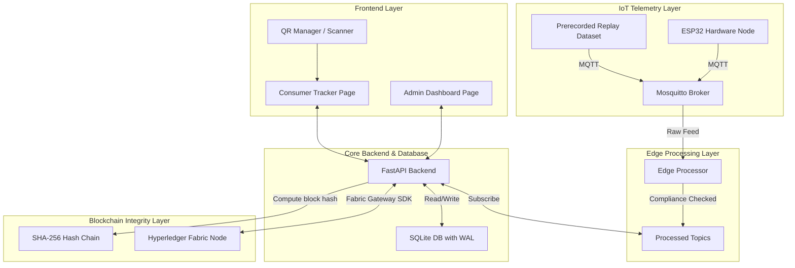

# FoodChain: Supply Chain Management in Food Sector with IoT & Blockchain

FoodChain is an enterprise-grade food supply chain traceability and compliance monitoring system. It leverages real-time IoT sensor telemetry, edge processing thresholds, and a dual-layer ledger design utilizing a local cryptographic SHA-256 Hash Chain combined with **Hyperledger Fabric** smart contract capabilities.

---

## 🏗️ System Architecture



---

## 🛠️ Technology Stack

| Component | Technology | Role |
|---|---|---|
| **IoT Telemetry** | NodeMCU / ESP32, DHT22 (Temp & Hum), NEO-6M (GPS) | Sensor readings and geo-location tracking |
| **Messaging** | Eclipse Mosquitto (MQTT) | Lightweight pub/sub telemetry transport |
| **Edge Layer** | Python / local script (Raspberry Pi compatible) | Stream preprocessing and alert extraction |
| **Backend API** | FastAPI (Python 3.13), Uvicorn | High-performance async REST API and MQTT client |
| **Security** | JWT (JSON Web Tokens), CryptContext (Bcrypt) | Secure login routes and role-based route guards |
| **Database** | SQLite3 (configured with WAL mode) | Off-chain structured data storage and indexing |
| **Blockchain** | Hyperledger Fabric (WSL2 Ubuntu) + SHA-256 | Immutable distributed ledger and smart contracts (`foodchain`) |
| **Frontend** | Vanilla JS, HTML5, CSS Variables, Leaflet.js, Chart.js | Interactive charts, live mapping, and QR camera scanner |

---

## ⚡ Quick Start (One-Click Launch & Shutdown)

### 1. Start All Services
Simply double-click or run:
```cmd
start.bat
```
*This automatically launches Hyperledger Fabric (WSL2), Mosquitto MQTT Broker, and the FastAPI Backend (`http://127.0.0.1:8001`) for physical ESP32 telemetry. The operational dashboards read live MQTT data only.*

### Explicit Legacy Demo Replay

Replay is isolated from live operation. Replay MQTT messages on `food/sensor/replay/#` are ignored by default, and the new producer, distributor, business, and admin dashboards never call replay endpoints.

For the legacy single-dashboard demo only, replay must be explicitly opted in:

- `FC-001`: Bengaluru Cold Storage Facility -> Mysuru Distribution Center
- `FC-002`: Bengaluru Processing Facility -> Mandya Warehouse
- `FC-003`: Bengaluru Warehouse -> Hassan Retail Distribution Hub

Open `http://127.0.0.1:8001/dashboard.html` only when intentionally testing the legacy demo controls. The page requests `demo=true`; it is not a source for operational dashboards. To allow replay MQTT ingestion for a controlled demo session, set `FOODCHAIN_ENABLE_REPLAY=1` before starting the backend. Leave it unset for real ESP32 operation.

Useful endpoints:

```text
GET  /api/replay/dataset?batch_id=FC-001&demo=true
GET  /api/replay/transportation?batch_id=FC-001&demo=true
POST /api/replay/start?batch_id=FC-001&interval_seconds=1.5&reset=true&demo=true
POST /api/replay/pause?demo=true
POST /api/replay/step?demo=true
POST /api/replay/reset?batch_id=FC-001&demo=true
```

### 2. Stop All Services
Simply double-click or run:
```cmd
stop.bat
```
*This cleanly stops all Docker containers, terminates background Python/MQTT processes, and closes terminal windows.*

---

## 📂 Project Directory Structure

```
food_chain/
├── start.bat                 # One-click startup script
├── stop.bat                  # One-click shutdown script
├── backend/                  # FastAPI Application
│   ├── main.py               # Slim entry point & app configuration
│   ├── config.py             # Global constants & thresholds
│   ├── database.py           # DB connection, init, migrations, & indexing
│   ├── auth.py               # JWT authentication logic & route guards
│   ├── schemas.py            # Pydantic input/output schemas
│   ├── mqtt_handler.py       # MQTT connection & message routing
│   ├── routes/               # API Router endpoints
│   │   ├── sensor.py         # Telemetry, batches, alerts, and uids
│   │   ├── tracking.py       # Detailed batch & UID history tracking
│   │   └── blockchain.py     # Hash chain verification & Fabric status
│   └── services/             # Core business service logic
│       ├── hash_chain.py     # SHA-256 block hash computation
│       ├── edge_health.py    # Multi-stage threshold checks
│       └── fabric_client.py  # Hyperledger Fabric Client gateway
├── blockchain/               # Hyperledger Fabric Workspace
│   ├── start_fabric.sh       # Clean WSL Fabric network launch & chaincode deploy
│   ├── stop_fabric.sh        # WSL Fabric network teardown
│   ├── test_invoke.sh        # Transaction invocation script
│   ├── submit_transaction.js # Node.js Fabric Gateway client
│   └── chaincode/            # JavaScript chaincode (smart contracts)
│       └── foodchain/
│           ├── foodchain.js  # ABAC, compliance, and event contracts
│           └── package.json  # Chaincode node packaging
├── frontend/                 # Client Web Pages
│   ├── css/                  # Shared stylesheet system
│   ├── js/                   # Shared scripts (Auth & Theme)
│   ├── login.html            # JWT login page
│   ├── home.html             # Landing portal page
│   ├── dashboard.html        # Admin control console
│   ├── qr.html               # QR manager and html5-qrcode camera scanner
│   └── track.html            # Consumer timeline & Leaflet map tracking
├── iot/                      # IoT source organization
│   ├── prerecorded_replay/   # Current demo replay notes and payload schema
│   └── real_devices/         # Future ESP32, DHT, gas, and GPS placeholders
└── README.md                 # Primary system documentation
```

---

## 🔍 Verification & Inspection

| Goal | Location / Endpoint | Details |
|---|---|---|
| **Product Trace UI** | `http://127.0.0.1:8001/track.html` | Search any Batch ID (e.g. `BATCH_001`) or Product UID (`UID-353581A7AE3B`) |
| **Fabric Status API** | `http://127.0.0.1:8001/api/blockchain/status` | Check Fabric peer status, channel (`mychannel`), and chaincode (`foodchain`) |
| **Hash Chain Verify** | `http://127.0.0.1:8001/verify/BATCH_001` | SHA-256 cryptographic chain tamper verification |
| **Off-Chain DB** | `backend/food_chain.db` | Open with DB Browser for SQLite -> inspect `sensor_data` table |
| **On-Chain Logs** | Docker Desktop / WSL | `wsl -d Ubuntu docker logs peer0.org1.example.com` |

---

## 🔒 Security & Default Credentials

Authentication is fully protected using **JWT token authorization**. The database seeds default roles on initial startup.

| Role | Username | Password | Access Level |
|---|---|---|---|
| **Admin** | `admin` | `admin123` | Master dashboard overview, blockchain verification |
| **Farmer** | `farmer` | `farmer123` | Update collection/harvest details |
| **Retailer** | `retailer` | `retail123` | Log retailer check-ins and handoffs |
| **Consumer** | *Guest* | *N/A* | Read-only scan access to track product timeline |

---

## 📄 License
This project is licensed under the Apache License 2.0.
